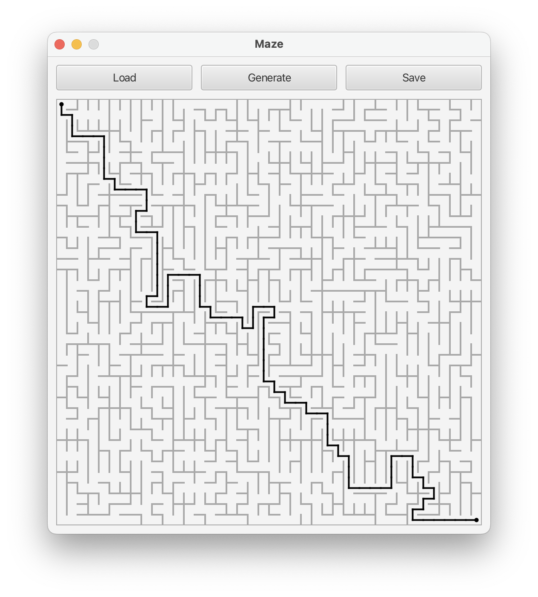
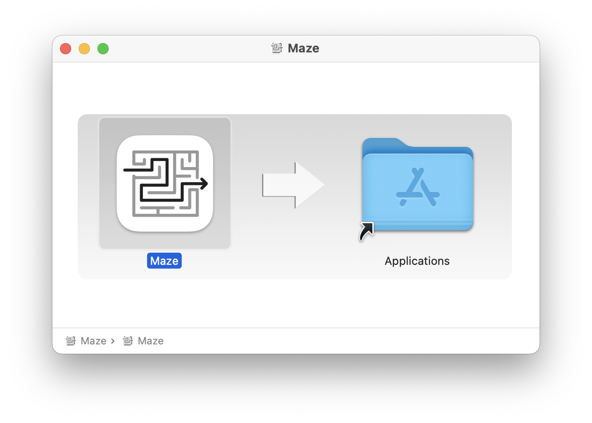

# Maze

<div align="center">
    
</div>

This is a JavaFX application for generating, solving, and visualizing mazes. It follows the **Model-View-Presenter (MVP)** pattern, separating the logic of generating and solving mazes from the view and presenter layers.

## Features
- Generate perfect mazes (it is possible to get from each point to any other point in exactly one way) with a customizable number of rows and columns.
- Load and save mazes from/to `.txt` files.
- Find and visualize the route between two points in the maze.
- Interactive maze visualization with points and routes drawn on a canvas.
  
## Project Structure
The project is structured using the MVP (Model-View-Presenter) pattern, which ensures a clear separation of concerns:

- **Model**: Responsible for generating and solving the maze. Handles the logic of maze creation, storage, and route finding.
- **View (MainWindowController)**: Responsible for rendering the maze on the screen, handling user input (e.g., mouse clicks on the canvas), and providing UI elements.
- **Presenter**: Acts as an intermediary between the model and the view. It processes user input and updates the view with the results from the model.

### Key Components
- **Model**: Contains the `Cell[][]` structure representing the maze, and methods for generating mazes, finding routes, and loading/saving maze configurations.
- **View (MainWindowControllerImpl)**: A JavaFX controller responsible for drawing the maze and route on the canvas, and interacting with UI components such as buttons.
- **Presenter**: Coordinates interactions between the model and the view. It handles requests from the view to generate or load mazes and updates the UI with the results.

### Technologies Used
- **JavaFX**: For building the graphical user interface.
- **MVP pattern**: To separate the business logic (model), UI logic (view), and the communication between them (presenter).
- **JUnit 5**: For unit testing the presenter and view layers.
- **Mockito**: For mocking dependencies in unit tests.

## Installation

### Prerequisites
- **Java 11** or higher
- **Maven** (for building the project and managing dependencies)

### Steps
1. Clone the repository:
   ```bash
   git clone https://github.com/nikolaymusatov/Maze.git
   ```
2. Navigate into the project directory:
   ```bash
   cd Maze
   ```
3. Build the project using Maven:
   ```bash
   mvn clean package
   ```
4. Build the installer:
   ```bash
   mvn exec:exec@installer
   ```
5. Drag the application into applications folder.
<div align="left">
    
</div>
6. Run it.

## Usage

1. Generate a maze: Click the "Generate Maze" button and set the desired number of rows and columns. The generated maze will be displayed on the canvas.
2. Load a maze: Click the "Load Maze" button to open a .txt file containing a maze configuration.
3. Save a maze: After generating or modifying a maze, you can save it by clicking the "Save Maze" button.
4. Find a route: Click on two different points in the maze to set a start and end point. The application will find and display the shortest path between them.